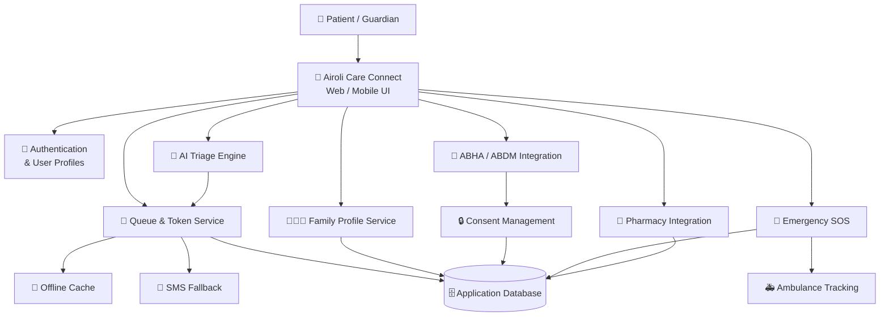
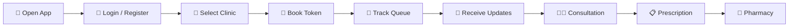

## Running the code

Run `npm i` to install the dependencies.

Run `npm run dev` to start the development server.

# 🏥 Airoli Care Connect

> **A smart healthcare coordination platform for patients, families, clinics, pharmacies, and emergency services in Airoli.**

Airoli Care Connect is designed to simplify healthcare coordination by bringing **live clinic queues, family bookings, offline access, SMS fallback, ABHA/ABDM integration, AI-assisted triage, pharmacy fulfillment, and emergency SOS coordination** into one connected platform.

The goal is simple: **reduce waiting, improve coordination, and make critical healthcare services more accessible and reliable.**

---

## 🚀 Why Airoli Care Connect?

Healthcare journeys often involve multiple disconnected steps:

```text
Patient
   ↓
Find Clinic
   ↓
Book Token
   ↓
Wait at Clinic
   ↓
Consult Doctor
   ↓
Prescription
   ↓
Pharmacy
   ↓
Emergency Support when needed
```

Airoli Care Connect connects these stages into a single coordinated experience.

### 🎯 Core Goals

- ⏱️ Reduce unnecessary clinic waiting
- 📱 Keep patients updated about their token
- 📶 Support poor-network and offline situations
- 👨‍👩‍👧 Manage healthcare for family members
- 🪪 Support ABHA/ABDM-based health identity
- 🔐 Provide consent-based health-record sharing
- 🤖 Assist patients with symptom-based triage
- 💊 Connect prescriptions with nearby pharmacies
- 🚨 Coordinate emergency SOS and ambulance services

---

# ✨ Key Features

## 🎫 1. Smart Token Visualization

Patients can monitor their clinic visit in real time.

### Features

- Live token number
- Current queue position
- Estimated waiting time
- "Being Called" status
- "Next" status
- Arrived / Not Arrived distinction
- Real-time queue updates

### Example Flow

```text
Your Token
    │
    ▼
Token #42
    │
    ▼
Currently Serving #39
    │
    ▼
3 Patients Ahead
    │
    ▼
Estimated Wait: 15 min
```

---

## 📩 2. SMS Fallback

Network connectivity should not determine whether a patient receives an important healthcare notification.

If real-time WebSocket or push communication fails:

```text
Real-Time Notification
        │
        ├── Push / WebSocket
        │        │
        │       SUCCESS
        │
        └── FAILURE
                 │
                 ▼
             SMS Fallback
```

Critical notifications can include:

- Token confirmation
- Token position changes
- "You are next"
- Appointment changes
- Important queue notifications

A mock SMS provider can be used during development and QA.

---

## 📶 3. Offline Queue Persistence

Patients should still be able to access their active token when connectivity is unavailable.

```text
        Server
          │
          ▼
    Active Token Data
          │
          ▼
   Local Secure Cache
          │
       INTERNET
          │
        OFFLINE
          │
          ▼
   Patient can still
   view current token
```

The application maintains cached token information and displays a synchronization state when local and server data differ.

---

## 👨‍👩‍👧 4. Family Profile Hub

One account can coordinate healthcare bookings for multiple family members.

### Supported relationships

- Self
- Child
- Spouse
- Parent

### Concept

```text
             Guardian
                 │
       ┌─────────┼─────────┐
       │         │         │
      Self     Child     Parent
       │         │         │
       └─────────┼─────────┘
                 │
            Bookings
```

Only authorized guardians can create or modify family healthcare tokens.

---

# 🪪 ABDM Health Stack

## 5. ABHA ID Onboarding

Airoli Care Connect is designed to support **ABHA-based healthcare identity integration**.

Users can link their ABHA ID during onboarding and maintain an account-level status:

```text
User Registration
       │
       ▼
   ABHA Linking
       │
       ▼
 Verification
       │
       ▼
abhaLinked
  true / false
```

Development environments can use a mock verification flow before connecting to real services.

---

## 🔐 6. Consent-Based Record Sharing

Health information should remain under patient control.

The platform provides a consent-oriented model for sharing records with healthcare providers.

```text
Patient
   │
   ▼
Select Doctor / Clinic
   │
   ▼
Grant Access
   │
   ▼
Set Expiry
   │
   ▼
Temporary Record Access
   │
   ▼
Automatic Expiration
```

Access can be controlled per clinic or doctor and can be time-limited.

---

# 🤖 AI-Driven Healthcare Coordination

## 7. Smart Triage Engine

The platform can provide an initial symptom-assistance flow before booking.

The intended workflow:

```text
Symptoms
   │
   ▼
3–5 Questions
   │
   ▼
Symptom Analysis
   │
   ├──────────────┬──────────────┐
   ▼              ▼              ▼
Emergency       Urgent         Routine
   │              │              │
   └──────────────┼──────────────┘
                  ▼
       Specialist Recommendation
                  │
                  ▼
              Booking
```

The triage feature is intended as a **routing and coordination aid**, not a replacement for professional medical diagnosis.

---

# 💊 8. Pharmacy-Link Fulfillment

After receiving a prescription, patients can send it to participating nearby pharmacies.

```text
Doctor
  │
  ▼
Prescription
  │
  ▼
Send to Pharmacy
  │
  ▼
Nearby Pharmacies
  │
  ├── Distance
  ├── ETA
  └── Availability
  │
  ▼
Selected Pharmacy
```

---

# 🚨 Emergency SOS

## 9. Dynamic SOS Dashboard

The emergency workflow is designed to coordinate a patient's location with an appropriate emergency facility.

```text
🚨 SOS Activated
       │
       ▼
Location Acquisition
       │
       ▼
Emergency Coordination
       │
       ▼
Nearest ER
       │
       ▼
Live Location Sharing
       │
       ▼
Arrival Preparation
```

An active emergency state remains clearly visible through a persistent emergency banner.

---

## 🚑 10. Ambulance Live Tracking

The emergency dashboard can provide live ambulance information.

### Planned information

- Ambulance location
- Real-time map marker
- ETA countdown
- Ambulance category

```text
🚨 Emergency
      │
      ▼
Ambulance Dispatched
      │
      ▼
     Live Map
      │
      ├── 🚑 Ambulance
      │
      ├── 📍 Patient
      │
      └── 🏥 Hospital
      │
      ▼
ETA Countdown
```

Supported ambulance categories include:

- BLS
- ALS
- ICU

---

# 🏗️ System Architecture

The platform follows a modular architecture so individual healthcare capabilities can evolve independently.



---

# 🔄 End-to-End Patient Journey



---

# 🧩 Project Roadmap

## 🔴 Phase 1 — Core Coordination & Reliability

| ID | Feature | Status |
|---|---|---|
| ACC-1 | Smart Token Visualization | 🚧 |
| ACC-2 | SMS Fallback Protocol | 🚧 |
| ACC-3 | Offline Queue Persistence | 🚧 |
| ACC-4 | Family Profile Hub | 🚧 |
| ACC-5 | ABHA ID Onboarding | 🚧 |
| ACC-6 | Consent-Based Record Sharing | 🚧 |

---

## 🟡 Phase 2 — AI & Fulfillment

| ID | Feature | Status |
|---|---|---|
| ACC-7 | Smart Triage Engine | 📋 Planned |
| ACC-8 | Pharmacy-Link Fulfillment | 📋 Planned |

---

## 🔵 Phase 3 — Emergency Coordination

| ID | Feature | Status |
|---|---|---|
| ACC-9 | Dynamic SOS Dashboard | 📋 Planned |
| ACC-10 | Ambulance Live Tracking | 📋 Planned |

---

# ⚙️ Non-Functional Requirements

The platform is designed around reliability, performance, privacy, and accessibility.

### ⚡ Performance

Emergency features should load and trigger within:

```text
≤ 2 seconds
```

on 3G-class network conditions.

### 📶 Offline Reliability

The active-token experience should remain available even when the device temporarily loses connectivity, including airplane mode after data has been cached.

### 🔐 Privacy

ABHA/ABDM-related functionality should follow applicable ABDM privacy and consent requirements.

### ♿ Accessibility

Interactive UI elements should maintain a minimum:

```text
4.5 : 1
```

color contrast ratio.

---

# 🛠️ Development Standards

A feature is considered complete when it satisfies the project's Definition of Done.

### ✅ Code Quality

- TypeScript standards followed
- Code reviewed
- Modular implementation
- Maintainable architecture

### 🧪 Testing

- Unit tests passed
- Critical workflows verified
- Mobile viewport tested

### 📚 Documentation

New:

- Types
- Utilities
- Services
- Important architectural decisions

should be documented appropriately.

### ♿ Accessibility

Interactive components must satisfy the required accessibility contrast standards.

---

# 🔒 Security & Privacy Principles

A healthcare platform requires privacy to be treated as a core architectural concern.

The project follows these principles:

- 🔐 Least-privilege access
- 👤 Patient-controlled consent
- ⏳ Time-limited record access
- 🛡️ Secure authentication
- 📦 Minimal data exposure
- 📶 Safe offline caching
- 🧾 Auditable healthcare actions
- 🔒 Protected sensitive information

> **Important:** Production deployment should use appropriate security reviews, consent mechanisms, encryption, authentication controls, and applicable healthcare/data-protection requirements.

---

# 📁 Suggested Project Structure

```text
airoli-care-connect/
│
├── src/
│   ├── components/
│   │   ├── token/
│   │   ├── family/
│   │   ├── abha/
│   │   ├── triage/
│   │   ├── pharmacy/
│   │   └── emergency/
│   │
│   ├── pages/
│   │
│   ├── services/
│   │   ├── queue/
│   │   ├── sms/
│   │   ├── abdm/
│   │   ├── pharmacy/
│   │   └── emergency/
│   │
│   ├── hooks/
│   ├── types/
│   ├── utils/
│   └── app/
│
├── tests/
│
├── public/
│
├── README.md
├── package.json
└── tsconfig.json
```

---

# 🧪 Testing Strategy

The project should test healthcare workflows rather than only individual UI components.

### Unit Testing

```text
Token Calculation
       ↓
Queue Position
       ↓
ETA Calculation
       ↓
Notification Logic
       ↓
Consent Expiry
```

### Integration Testing

```text
Patient
  ↓
Token Booking
  ↓
Queue Service
  ↓
Notification
  ↓
Dashboard
```

### Emergency Testing

```text
SOS
 ↓
Location
 ↓
Emergency Service
 ↓
Ambulance
 ↓
Live Tracking
```

### Offline Testing

Test scenarios should include:

- Internet disconnected
- Airplane mode
- Cached token available
- Server state changed while offline
- Reconnection
- Synchronization conflicts

---

# 📊 Acceptance Criteria Summary

| Story | Core Requirement |
|---|---|
| ACC-1 | Live token and waiting position |
| ACC-2 | SMS fallback for critical notifications |
| ACC-3 | Offline active-token access |
| ACC-4 | Guardian family management |
| ACC-5 | ABHA onboarding |
| ACC-6 | Time-limited consent |
| ACC-7 | Symptom-based specialist routing |
| ACC-8 | Pharmacy handoff |
| ACC-9 | Emergency location coordination |
| ACC-10 | Live ambulance tracking |

---

# 🎯 Project Vision

Airoli Care Connect aims to create a connected healthcare journey where:

```text
       👤 PATIENT
           │
           ▼
      🏥 CLINIC
           │
     ┌─────┴─────┐
     ▼           ▼
   🎫 QUEUE    👨‍⚕️ DOCTOR
     │           │
     │           ▼
     │       📋 RECORD
     │           │
     │           ▼
     │       💊 PHARMACY
     │
     └──────────────┐
                    ▼
               🚨 EMERGENCY
                    │
                    ▼
                 🚑 AMBULANCE
                    │
                    ▼
                 🏥 HOSPITAL
```

The long-term vision is to make healthcare coordination **faster, more connected, more reliable, and easier for patients and families to navigate.**

---

## 📌 Current Focus

The initial development focus is on:

**Core coordination → reliable token management → offline support → family profiles → ABHA/ABDM integration**

followed by:

**AI-assisted triage → pharmacy fulfillment → emergency coordination → ambulance tracking.**

---

## 🤝 Contributing

Contributions, suggestions, bug reports, and feature proposals are welcome.

Before contributing:

1. Review the project architecture.
2. Check existing issues and backlog items.
3. Follow the TypeScript coding standards.
4. Add tests for new functionality.
5. Update documentation when necessary.
6. Verify the UI on mobile viewport sizes.

---

## 📄 License

Add the project's selected license here before public production distribution.

---

<p align="center">

### 🏥 Airoli Care Connect

**Connecting Patients • Clinics • Pharmacies • Families • Emergency Services**

</p>
</p>
